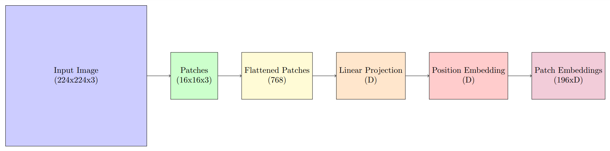
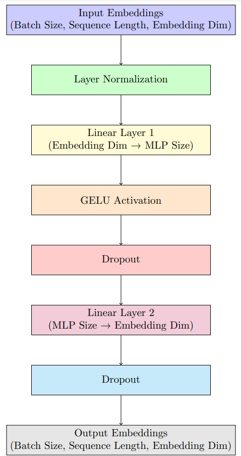
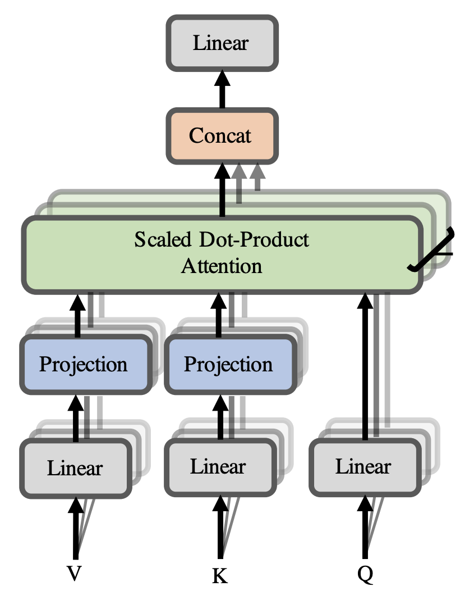
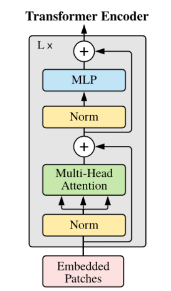

# Vision Transformer (ViT) Implementation in PyTorch

This repository provides a comprehensive implementation of the Vision Transformer (ViT) model in PyTorch. ViT leverages transformer architectures, originally designed for natural language processing, to achieve state-of-the-art performance in image classification tasks.

## Architecture Overview

---
### Patch Embedding


1. #### Splitting the   Image into Patches:
   1. The input image is divided into non-overlapping patches of a fixed size, such as 16x16 pixels.
   2. This division transforms the image into a sequence of smaller, manageable units.
   
2. #### Flattening and Linear Projection:
   1. Each patch is flattened into a one-dimensional vector.
   2. These vectors are then linearly projected into a higher-dimensional space, typically matching the embedding dimension of the transformer model.

3. #### Adding Positional Embeddings:
   1. Since transformers lack inherent spatial awareness, positional embeddings are added to the patch embeddings.
   2. These embeddings encode the position of each patch within the original image, preserving spatial information.

4. #### Adding a Class Token:
   1. A special learnable token, often referred to as the "class token," is prepended to the sequence of patch embeddings.
   2. This token aggregates information from all patches and is used for classification tasks.
---

### Multi Layer Perceptron (MLP) Block
<div style="text-align: center;"></div>

   1. #### Structure of the MLP Block:
      1. First Linear Layer: The input from the attention mechanism is projected into a higher-dimensional space, expanding the feature representation. 
      2. Activation Function: A non-linear activation function, such as GELU, introduces non-linearity, enabling the model to capture complex patterns. 
      3. Second Linear Layer: The activated features are then projected back to the original embedding dimension, maintaining consistency with the input dimensions.
   
   2. #### Purpose of the MLP Block:
      1. Feature Transformation: The MLP block allows the model to learn complex, non-linear transformations of the input features, enhancing its representational capacity. 
      2. Dimensionality Consistency: By projecting the features back to the original embedding dimension, the MLP block ensures that the output can be seamlessly integrated with subsequent layers, such as the residual connection and layer normalization.
---

### Multi-Head Self-Attention Mechanism
<div style="text-align: center;"></div>

   1. #### Structure of the Multi-Head Self-Attention Mechanism:
      1. Input Representation: The input image is divided into non-overlapping patches, each flattened into a vector.
           These patch embeddings serve as the input tokens for the attention mechanism. 

      2. Linear Projections: The input tokens are linearly projected into three distinct spaces to create:
         1. Query (Q): Represents the information to be matched. 
         2. Key (K): Represents the information to be searched. 
         3.  Value (V): Represents the information to be retrieved. 

      3. Scaled Dot-Product Attention:
         1.  For each attention head, the attention scores are computed by taking the dot product of the Query and Key matrices, scaling the result, and applying a softmax function to obtain the attention weights. 
         2. These weights are then used to compute a weighted sum of the Value vectors, producing the attention output for that head.

      4. Concatenation and Final Linear Projection:
         1. The outputs from all attention heads are concatenated.
         2. A final linear projection is applied to this concatenated vector to produce the final output of the MHSA mechanism.

   2. #### Purpose of the Multi-Head Self-Attention Mechanism:
   
      1. Capturing Diverse Relationships:
         1. By employing multiple attention heads, the model can focus on different parts of the input simultaneously, capturing a variety of relationships and patterns within the image.
         
      2. Enhancing Representational Capacity:
         1. The parallel processing of multiple attention heads allows the model to learn richer and more complex feature representations, improving its performance on vision tasks.
          
      3. Facilitating Global Context Understanding:
         1. The self-attention mechanism enables each patch to attend to all other patches, allowing the model to understand the global context of the image, which is crucial for tasks like image classification and segmentation.

---

### Transformer Encoder Block
<div style="text-align: center;"></div>
   
   1. #### Structure of the Transformer Encoder Block:
      1. Layer Normalization:
         - Applies normalization to the input embeddings to stabilize and accelerate the training process.
      2. Multi-Head Self-Attention (MHSA):
         - Enables the model to focus on different parts of the input sequence simultaneously, capturing various relationships and patterns within the image. 
      3. Residual Connection:
         - Adds the original input to the output of the MHSA layer, facilitating gradient flow and mitigating issues like vanishing gradients.
      4. Layer Normalization:
         - Applies another normalization step after the residual connection to maintain stability. 
      5. Feed-Forward Neural Network (FFN):
         - Consists of two linear layers with a non-linear activation function (e.g., GELU) in between, allowing the model to learn complex transformations of the input features. 
      6. Residual Connection:
         - Adds the input of the FFN to its output, similar to the previous residual connection, ensuring efficient information flow.

   2. #### Purpose of the Transformer Encoder Block:
      1. Contextual Representation Learning:
         - By employing MHSA, the encoder block enables each image patch to attend to all other patches, facilitating a comprehensive understanding of the global context. 
      2. Hierarchical Feature Extraction:
         - The combination of MHSA and FFN allows the model to extract and process features at multiple levels of abstraction, enhancing its ability to recognize complex patterns. 
      3. Stability and Efficiency:
         - Layer normalization and residual connections contribute to stable and efficient training, allowing the model to converge faster and achieve better performance.
---

### Vision Transformer (ViT) 


   1. #### Key Components of the Vision Transformer:
      1. Patch Embedding:
         - The input image is divided into fixed-size patches (e.g., 16x16 pixels). 
         - Each patch is flattened into a one-dimensional vector. 
         - These vectors are linearly projected into an embedding space, forming the input sequence for the transformer.
      2. Positional Embedding:
         - Since transformers lack inherent spatial understanding, positional embeddings are added to the patch embeddings to retain spatial information within the image.
      3. Transformer Encoder:
         - A series of transformer encoder layers process the sequence of embedded patches, capturing relationships between different parts of the image.
      4. Classification Token ([CLS] Token):
         - A learnable embedding, known as the classification token, is prepended to the sequence of patch embeddings. 
         - The output corresponding to this token is used for classification tasks. 
      5. Classification Head:
         - Typically implemented as a feed-forward neural network, it processes the [CLS] token's output to produce the final classification.
   
   2. #### Advantages of Vision Transformers:
      1. Scalability:
         - ViTs can scale effectively with increased data and model sizes, achieving superior performance on large datasets.
      2. Global Context Understanding:
         - The self-attention mechanism enables ViTs to capture long-range dependencies within images, providing a comprehensive understanding of the visual content.
      3. Flexibility:
         - ViTs can be adapted to various vision tasks beyond classification, including object detection and segmentation.
---

## Repository Structure

The project is organized as follows:


- **`models/`**: Contains the core components of the ViT model.
    - `__init__.py`: Initializes the models package.
    - `ViT.py`: Defines the Vision Transformer class.
    - `Transfomer.py`: Implements the Transformer Encoder block.
    - `MLPBlock.py`: Contains the Multi-Layer Perceptron (MLP) block used in the transformer.
    - `PatchEmbedding.py`: Handles the patch embedding layer.
    - `MultiHeadAttention.py`: Implements the multi-head attention mechanism.

- **`train.py`**: Script to train the ViT model on the CIFAR-100 dataset.
- **`utils.py`**: Includes utility functions for data loading and preprocessing.
- **`README.md`**: This file, providing an overview of the project.

## Requirements

Ensure you have the following Python packages installed:

- `torch`
- `torchvision`
- `tqdm`
- `numpy`
- `matplotlib`

You can install them using pip:

```bash
pip install torch torchvision numpy matplotlib tqdm 
```

```bash
python -m venv vit
source vit/bin/activate
pip install -r requirements.txt
python train.py
```

## References

<a id="reference1">[1]</a> Dosovitskiy, A., et al. "An Image is Worth 16x16 Words: Transformers for Image Recognition at Scale." [https://arxiv.org/abs/2010.11929](https://arxiv.org/abs/2010.11929)
